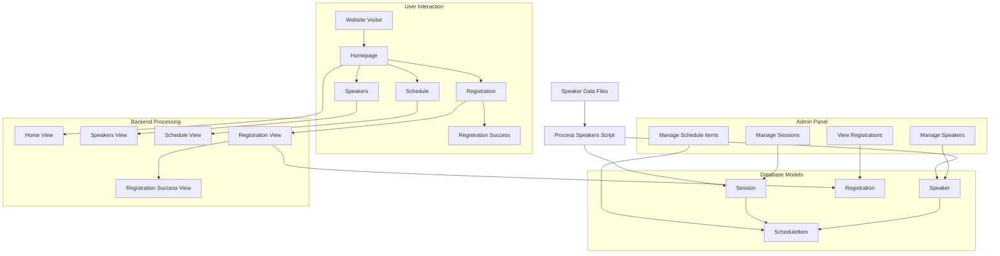
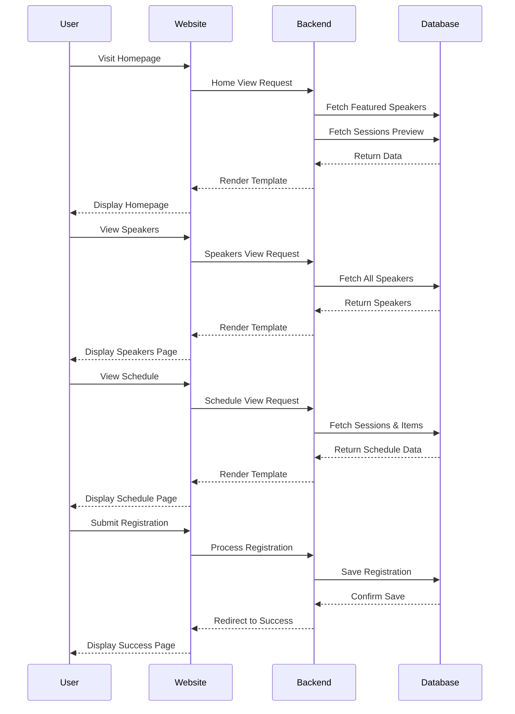
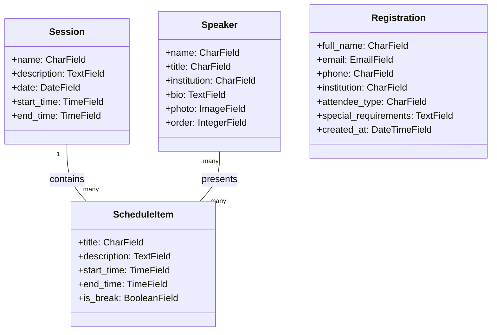

# KHCC Conference Website Architecture

```mermaid
graph TD
    subgraph User[User Interaction]
        A[Website Visitor] --> B[Homepage]
        B --> C[Speakers]
        B --> D[Schedule]
        B --> E[Registration]
        E --> F[Registration Success]
    end

    subgraph Models[Database Models]
        G[Speaker] --> H[ScheduleItem]
        I[Session] --> H
        J[Registration]
    end

    subgraph Views[Backend Processing]
        K[Home View] 
        L[Speakers View]
        M[Schedule View]
        N[Registration View]
        O[Registration Success View]
    end

    subgraph Admin[Admin Panel]
        P[Manage Speakers]
        Q[Manage Sessions]
        R[Manage Schedule Items]
        S[View Registrations]
    end

    C --> L
    D --> M
    E --> N --> J
    N --> O
    B --> K
    P --> G
    Q --> I
    R --> H
    S --> J

    %% Data processing
    T[Speaker Data Files] --> U[Process Speakers Script]
    U --> G
    U --> I
```

```mermaid
sequenceDiagram
    participant User
    participant Website
    participant Backend
    participant Database

    User->>Website: Visit Homepage
    Website->>Backend: Home View Request
    Backend->>Database: Fetch Featured Speakers
    Backend->>Database: Fetch Sessions Preview
    Database-->>Backend: Return Data
    Backend-->>Website: Render Template
    Website-->>User: Display Homepage

    User->>Website: View Speakers
    Website->>Backend: Speakers View Request
    Backend->>Database: Fetch All Speakers
    Database-->>Backend: Return Speakers
    Backend-->>Website: Render Template
    Website-->>User: Display Speakers Page

    User->>Website: View Schedule
    Website->>Backend: Schedule View Request
    Backend->>Database: Fetch Sessions & Items
    Database-->>Backend: Return Schedule Data
    Backend-->>Website: Render Template
    Website-->>User: Display Schedule Page

    User->>Website: Submit Registration
    Website->>Backend: Process Registration
    Backend->>Database: Save Registration
    Database-->>Backend: Confirm Save
    Backend-->>Website: Redirect to Success
    Website-->>User: Display Success Page
```

```mermaid
classDiagram
    class Speaker {
        +name: CharField
        +title: CharField
        +institution: CharField
        +bio: TextField
        +photo: ImageField
        +order: IntegerField
    }
    
    class Session {
        +name: CharField
        +description: TextField
        +date: DateField
        +start_time: TimeField
        +end_time: TimeField
    }
    
    class ScheduleItem {
        +title: CharField
        +description: TextField
        +start_time: TimeField
        +end_time: TimeField
        +is_break: BooleanField
    }
    
    class Registration {
        +full_name: CharField
        +email: EmailField
        +phone: CharField
        +institution: CharField
        +attendee_type: CharField
        +special_requirements: TextField
        +created_at: DateTimeField
    }
    
    Session "1" -- "many" ScheduleItem: contains
    Speaker "many" -- "many" ScheduleItem: presents
``` 